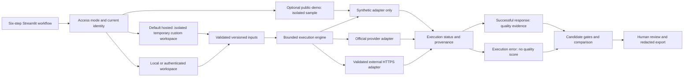

# Architecture

## Product and trust boundary

AI Reliability Studio evaluates a support assistant; it does not serve that assistant to customers. It owns versioned evaluation inputs, bounded execution, deterministic assessment, inspectable reports and local review history. A human/domain owner retains the release decision. Foundation-model providers and external assistant endpoints are outside the application boundary.

The primary UI sequence is **Start → Prepare → Connect → Evaluate → Review → History**. Preparation groups project, sources, cases and prompt. Advanced controls expose calibration, retrieval inspection and detailed analysis without adding first-level destinations.

This diagram describes responsibility, not a durable distributed deployment. The current web execution path runs in process. A restart can interrupt work; managed workers and recovery infrastructure remain extensions.

## Access modes and persistence

| Mode | Identity and repository | Allowed workflow |
|---|---|---|
| `hosted-session` (new native default) | Private temporary database, random identity and bounded session budget per visitor; no shared persistent database | Custom data/reviews, explicit session keys, guarded public HTTPS targets, bounded runs and project download/restore on the main site |
| `public-demo` (optional) | Dedicated `EphemeralSQLiteRepository` in each Streamlit session; no shared persistent database opened by that UI session | Explicitly restricted sample deployment; not the main-site product requirement |
| `local` | Explicit trusted operator and persistent SQLite; loopback server binding | Approved custom evaluation, session/configured keys, saved release history |
| `authenticated` | Trusted proxy identity on each rerun, provisioned membership/role and managed PostgreSQL/RLS deployment | Shared partner use only after infrastructure controls are verified |

`database.initialize_session` clears and binds repository/context for each rerun using `ContextVar`. Authentication failures discard earlier authorization. Identity changes invalidate session memory and require a fresh session. Repository methods reauthorize the stored identity and role; hiding a UI control is not the authorization boundary. Disabled/revoked users and forged role values do not grant access.

The local CLI is a separate trusted-operator interface. It creates a SQLite project and writes a report; it is not a multi-tenant hosted API. Real CLI calls need an explicitly private mode. The anonymous Streamlit storage guarantee does not claim that arbitrary local Python/CLI use cannot write files.

## Modules and responsibilities

| Area | Modules | Responsibility |
|---|---|---|
| Domain and provenance | `domain.py`, `versioning.py`, `provenance.py` | Typed execution/evidence states, immutable hashes, run manifests, hydration of stored evidence |
| Identity and security | `auth.py`, `security.py` | Trusted identity resolution, stored role checks, safe filenames/input limits, pattern and known-credential redaction |
| Persistence | `storage.py`, `database.py`, `migrations.py` | Session/context binding, ephemeral or persistent workspace repositories, immutable versions, idempotent results, audits |
| Inputs | `datasets.py`, `document_loader.py`, `chunker.py` | Strict cases, extraction warnings, deduplication, passage/source provenance |
| Hosted input containment | `hosted_documents.py`, `hosted_document_worker.py` | Credential-free parser subprocess, wall-time/CPU/output bounds and Linux memory limits; not an OS security sandbox |
| Hosted service admission | `hosted_limits.py`, `public_sessions.py` | Session/process capacity and call limits, per-session run exclusion, memory-only authorization binding |
| Project portability | `project_workspace.py` | Bounded structured project downloads and atomic restoration; supplied provenance never becomes authenticated live evidence |
| Retrieval | `embeddings.py`, `vector_store.py`, `retrieval.py` | Pluggable embeddings, lexical/TF-IDF hybrid search, filtering, reference-retrieval metrics |
| Targets | `targets.py`, `llm_client.py` | Synthetic/provider/HTTP adapters, explicit credentials and destinations, response parsing, safe failures |
| Execution | `execution.py`, `evaluator.py` | Concurrency, retry/backoff/cancellation helpers, execution keys, candidate runs, persisted status and measurements |
| Evaluation | `scoring.py`, `judges.py`, `aggregation.py`, `calibration.py` | Constraint/citation/grounding/escalation checks, uncertainty, critical labels, advisory judges, held-out calibration, candidate gates |
| Product surfaces | `app.py`, `cli.py`, `charts.py`, `presentation.py`, `reporting.py` | Guided UI, CLI gates, summaries, failure interpretation, guarded comparison and exports |
| Product measurement | `product_analytics.py` | Fixed local event schema; bounded choices/counts/durations; no payload collector |
| Operations and extensions | `review.py`, `automation.py`, `observability.py`, `infrastructure.py` | Human review helpers, drift/log-ingestion primitives, sanitized health/metrics, queue/store/scanner/OCR/scheduler interfaces |

## Evaluation lifecycle

1. Resolve the current access mode and workspace context before reading saved inputs. Custom UI work requires data-handling acknowledgment and a saved project.
2. Validate approved documents/cases and record immutable document, prompt, dataset and target versions. Reopening a project loads its own latest configuration and results.
3. Build a manifest for one candidate's prompt, dataset, documents, target, retrieval, evaluator/threshold and requested model settings. Preserve configured versus provider-reported identity separately.
4. Show planned executions and maximum attempts, concurrency/retry settings, data flow and cost limitations. Real-call consent is bound to the current preflight configuration; changing it requires confirmation again.
5. Execute each case through the selected adapter. Synthetic execution never becomes a real fallback. Direct-provider SDK retries are disabled so the engine owns retries. Permanent client/authentication failures do not retry blindly.
6. Persist successful responses and measurements or sanitized execution errors. Errors receive no quality score and do not fill the successful-case sample minimum. Credential echoes are discarded and retain critical privacy evidence without storing the credential.
7. Assess successful responses against expected behavior and source evidence. Preserve support/contradiction/uncertainty and traceable passages. Deterministic critical findings cannot be overridden by an advisory model judge.
8. Apply gates per candidate, with applicable calibration, sample/coverage, resource and execution-health requirements. Missing evidence stays missing. Synthetic candidates always receive the synthetic-only verdict.
9. Compare compatible runs using stable case identities and versions. Changed datasets/evaluators, missing cases, synthetic output or ambiguous candidate sets produce an inconclusive comparison rather than a winner.
10. Present the failure, severity, likely next action and missing evidence; record the human's coded decision and export a redacted report. The next release reuses reviewed cases and baseline evidence.

Studio's local reference retrieval is visible even for external targets. Without the assistant's returned retrieval trace, it must not be described as measurement of the assistant's internal retrieval. The default embedder uses lightweight TF-IDF; semantic embeddings require an explicitly configured provider. Deterministic scoring cannot establish every semantic implication.

## Data model and invariants

The primary graph is:

`workspace → project → document/prompt/dataset/target → immutable versions → candidate run → executions → scores/reviews/exports`

Workspace audit records separately retain authorization actions and fixed product events. SQLite keeps compatibility result columns and normalized execution/score tables. PostgreSQL stores normalized operational fields and result JSONB. Expected behavior and provenance survive persistence and export; historical versions are retained when inputs change.

Result persistence is idempotent for the same run/case/prompt/target. SQLite uses a transaction and PostgreSQL locks the run row to avoid duplicate result/score/completion records under concurrent retries. This guarantees persistence behavior, **not exactly-once side effects at a remote endpoint**. The beta assumes read-only staging assistants.

SQLite migrations are additive and associate legacy rows with the local workspace. PostgreSQL workspace-owned queries use explicit predicates and transaction-local `ars.workspace_id` with RLS. Migration/RLS tests on a disposable server do not validate managed identity, backup, or recovery operations on another deployment.

## Network and secret handling

External configuration rejects secret-bearing query/header/body fields and malformed mappings. Runtime secret references resolve supplied values, with environment access allowed only when trusted code explicitly selects names. Actual network requests validate destination addresses, pin the selected address while checking the original TLS hostname, reject redirects, and avoid inherited proxies. Health requests follow the same destination policy. Local loopback development is an explicit exception; ordinary remote targets require HTTPS.

Direct-provider calls use scoped HTTPX clients with bounded timeouts, explicit official destinations and closed resources. Requested settings, reported model identity, refusal/finish metadata and unknown pricing are preserved. Model-specific sampling rules are versioned/documented rather than inferred for future models. The pinned Google SDK transport currently uses private SDK internals and must be retested when upgrading that SDK.

Credentials stay in session/runtime configuration and never enter saved target definitions. Returned data is checked for exact known credentials as well as general secret patterns; credential echoes are withheld before scoring/persistence. These controls do not guarantee arbitrary personal or proprietary information can be recognized. Approved input selection and export review remain necessary.

## Product events and observability

`product_analytics.py` accepts registered event names with fixed enums, booleans, bounded numeric counts/durations and local entity references. A random `journey_id` joins events within a product session without using an authentication session credential. Unknown/free-text fields reject before storage. The sink is the authorized workspace audit log; there are no analytics network requests or public cross-session fingerprints.

Product events do not store prompts, document text, answers, credentials, names, email addresses, endpoint URLs, IP addresses or raw exception messages. The audit envelope still contains workspace/user authorization metadata and is not claimed to be anonymous. De-identified discovery, comprehension, retention and commercial outcomes require separate consented research; events alone cannot prove customer value.

Application observability has sanitized structured logs and local metrics/health primitives. Deployment operators must provide external monitoring, alerting and retention enforcement. No uptime or operational guarantee follows from a local health check.

## Extensions and non-goals

- Add a `TargetAdapter` for a supported read-only target protocol while retaining evidence/status contracts.
- Add an `EmbeddingProvider`/reranker with honest retrieval provenance.
- Replace in-process/local queue, artifact and schedule implementations with durable services if the deployment requires recovery across restarts.
- Supply isolated malware scanning and OCR adapters where required. Unavailable adapters do not invent a clean scan or extracted text.
- Validate any model-judge policy change against independent human labels and version it. Judges remain advisory by default.

Autonomous action approval, regulated decision certification, generic agent benchmarking and enterprise observability replacement are outside this beta. Managed identity/database/storage/workers, scanning, monitoring, retention/backups and infrastructure validation remain explicit deployment work. See [deployment](DEPLOYMENT.md), [security review](design-partner/security-review.md), and [evaluation methodology](EVALUATION_METHODOLOGY.md).
