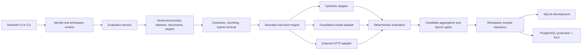

# Architecture

## System boundary

AI Reliability Studio evaluates a target assistant. It is not the assistant itself. The system owns evaluation inputs, execution orchestration, deterministic scoring, evidence aggregation, and audit history. Foundation-model vendors and external assistant APIs remain outside the trust boundary.

## Modules and responsibilities

| Area | Modules | Responsibility |
|---|---|---|
| Domain | `domain.py`, `versioning.py` | Typed states, roles, evidence objects, immutable hashes, run manifests |
| Identity/security | `auth.py`, `security.py` | Trusted identity resolution, RBAC, upload limits, filename safety, secret and PII redaction |
| Persistence | `storage.py`, `database.py`, `migrations.py` | Workspace-scoped repository, backward-compatible facade, additive migrations, audit events |
| Inputs | `datasets.py`, `document_loader.py`, `chunker.py` | Strict rows, version snapshots, extraction warnings, structural provenance and deduplication |
| Retrieval | `embeddings.py`, `vector_store.py`, `retrieval.py` | Pluggable embeddings, hybrid search, thresholds/filters, retrieval-only metrics |
| Targets | `targets.py`, `llm_client.py` | Synthetic, direct provider, and external HTTP adapters with sanitized errors |
| Execution | `execution.py`, `evaluator.py` | Concurrency, retries/backoff, cancellation, checkpoints/cache, reproducible candidate runs |
| Evaluation | `scoring.py`, `judges.py`, `aggregation.py`, `calibration.py` | Constraint/claim/citation/escalation checks, versioned advisory judges, multi-label safety, held-out human calibration, candidate gates and CIs |
| Product surfaces | `app.py`, `cli.py`, `charts.py`, `presentation.py`, `reporting.py` | UI, layered failure presentation, automation interface, analytics, redacted reports and exit codes |
| Operations | `review.py`, `automation.py`, `observability.py`, `infrastructure.py` | Human review, log ingestion/drift, structured logs, health/metrics, and explicit queue/artifact/scanner/OCR/scheduler/retention extension contracts |

## Execution lifecycle

1. Identity resolves to a `WorkspaceContext`; every repository operation reauthorizes it.
2. Documents, dataset, prompt, and target configuration are validated and stored as immutable versions.
3. A run manifest hashes exact versions and records retrieval, evaluator, model, environment, application, user, workspace, and Git metadata.
4. One execution is created per case and prompt/model/target candidate. An idempotency key prevents duplicate persistence.
5. The engine applies bounded concurrency, timeout, retry/backoff, cancellation, cache, and resume policy.
6. Failed infrastructure executions retain sanitized status/metadata and receive no quality score.
7. Successful responses receive retrieval metrics, claim/citation/escalation assessments, safety labels, explanations, and confidence.
8. Aggregation groups candidates independently, reports unique cases and executions separately, and applies configured launch gates.

## Storage model

The core graph is:

`workspace → project → {document, prompt, dataset, target} → immutable versions → run → execution → score/review/export/audit`

Legacy result columns remain available in SQLite for compatibility. New normalized executions and scores are the authoritative record. PostgreSQL stores the complete result payload in JSONB alongside normalized operational fields.

SQLite migrations are additive and backfill pre-workspace rows into the configured local workspace. No migration drops user tables. PostgreSQL policies constrain workspace-owned tables using the transaction-local `ars.workspace_id` setting; application queries also include explicit workspace predicates as defense in depth.

## Extension boundaries

- Implement `TargetAdapter` to add a target without changing scoring or storage.
- Implement `EmbeddingProvider` or a reranker to strengthen retrieval while preserving retrieval metrics.
- Replace the in-process executor with a durable queue while retaining execution keys, statuses, checkpoints, and cancellation semantics.
- Replace `InMemoryJobQueue`, `LocalArtifactStore`, and `LocalScheduleRegistry` with durable deployment adapters. Every bundled local adapter declares `production_ready = False` and loses either process or host state.
- Implement `MalwareScanner` and `OCRPipeline` in isolated workers. The unavailable adapters return an explicit unavailable result and never fabricate a clean scan or extracted text.
- Implement `NotificationHook` and a managed scheduler without fabricating successful scheduling in local mode.
- Keep any LLM judge advisory unless an explicit, validated policy change is versioned.

## Failure policy

The platform fails closed around evidence: missing secrets, invalid responses, authentication failures, timeouts, and provider errors cannot become mock answers; title-only citations cannot become support; synthetic runs cannot become readiness evidence; and cross-workspace identifiers cannot bypass authorization.
